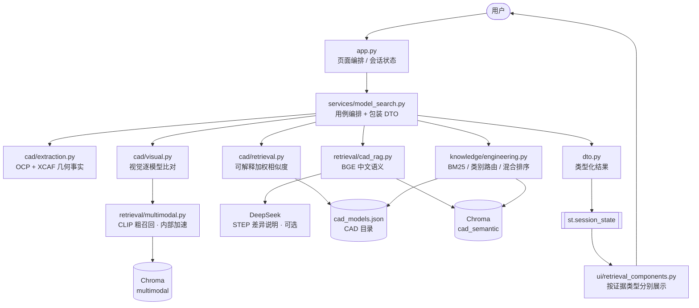
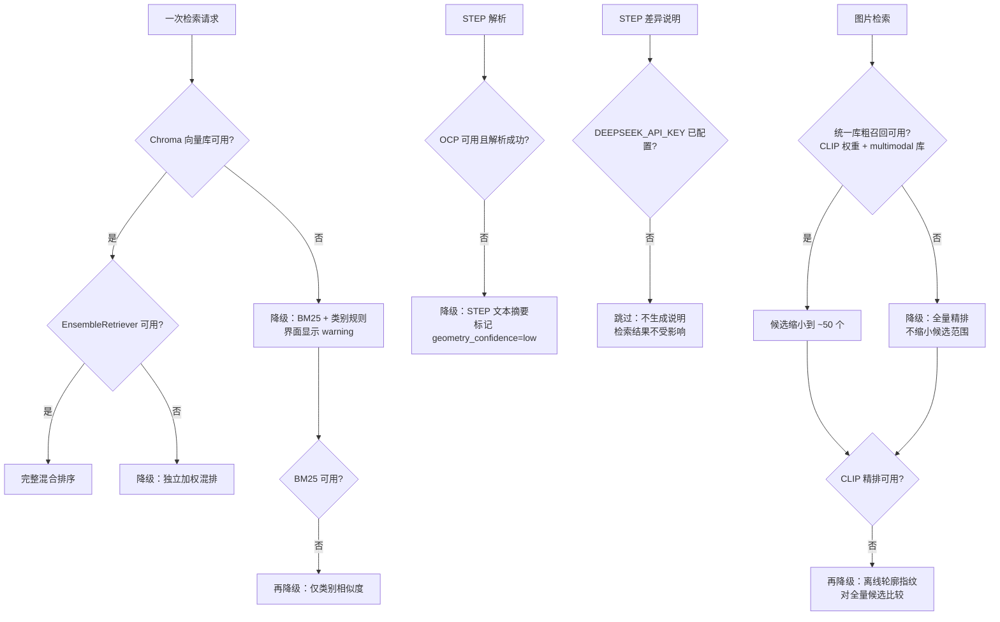
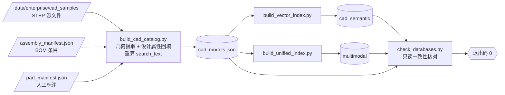

# machining_unified_ai 接手指南

> 面向新接手本项目的 Claude/Codex/开发人员。请先阅读本文件，再修改代码或数据库。

## 1. 30 秒了解项目

这是一个独立的机械智能制造融合项目：

- 前端 UI 继承自 `machining_process_rag1`；
- STEP 几何解析、模型检索和混合 RAG 主要吸收自 `step_model_retrieval`；
- 两个源项目仅作为历史来源保留，日常开发只修改本项目；
- 主入口是根目录 `app.py`，业务实现全部放在 `machining_unified/` 包内；
- 页面只有一个工作区：模型检索（企业资料问答工作区已于 2026-08-17 移除，见第 12 节）；
- 数据库不是一个库，而是两套用途和向量空间不同的 Chroma 库。

项目目录（当前主副本，日常开发只改这里）：

```text
C:\Users\w\Desktop\machining_unified_ai
```

`C:\Users\w\PycharmProjects\machining_ai_workspace\machining_unified_ai` 是同内容的旧副本，不再维护；不要在那里改代码。

只读历史源项目：

```text
C:\Users\w\PycharmProjects\machining_ai_workspace\machining_process_rag1
C:\Users\w\PycharmProjects\machining_ai_workspace\step_model_retrieval
```

除非用户明确要求，不要修改、移动或删除这两个源项目。

## 2. 必须遵守的设计边界

1. **UI 以当前融合项目为准。** 不要重新复制源项目页面覆盖 `app.py` 或 `machining_unified/ui/`。
2. **业务代码只放在 `machining_unified/`。** 根目录除 `app.py` 外不要再次创建业务模块副本。
3. **数据路径只能从 `machining_unified/config/paths.py` 引用。** 不要在业务代码中拼接 `data/...` 硬编码路径。
4. **两套向量库保持独立。** 它们的嵌入模型、内容和分数含义不同，不能直接合并分数或集合。
5. **检索证据与模型推断必须区分。** 几何事实、语义相似度、知识图谱候选和 LLM 建议不可伪装成同一种证据。
6. **生产使用前需要人工复核。** 几何候选、图谱推断的装配关系和检索排序都不能被描述为已自动确认的生产事实。
7. **图号标准化规则只有一份。** 写入期各处（`scripts/import_assembly_package.py`、`scripts/decompose_assembly_step.py`、
   `knowledge/manifests.py` 的设计属性回填）必须共用 `knowledge/part_ids.py`。企业资料问答移除后，
   这条规则不再有查询期消费方——`part_ids.py` 现在只在导入/构建阶段跑，不再解析用户输入。
8. **不要提交秘密或本地大文件。** `.env`、向量库和企业 STEP/BOM/图纸已由 `.gitignore` 排除。

## 3. 入口与请求流

`app.py` 只负责页面编排、会话状态和调用服务层。



结果先落 `st.session_state`、再由 UI 渲染，是刻意的闭环：检索只在**提交那一次重跑**里执行，
后续任何交互（改返回数量、切查询方式）都只重放会话状态，不会清空结果也不会重复检索。

各分支的分数含义不同（几何是代码加权分、BGE 是余弦），因此 DTO 按分支分成不同类型，
UI 分区展示，**不做合并排序**。CLIP 不在此列——它只是 `cad/visual.py` 图片检索内部的
粗召回加速手段，分数不对外展示，也不出现在 DTO 里（见第 6 节）。

页面组件位于：

- `machining_unified/ui/components.py`：模型检索工作区的页面组件；
- `machining_unified/ui/retrieval_components.py`：检索结果展示；
- `machining_unified/ui/styles.py`：加载工业风 CSS；
- `assets/industrial.css`：主样式；
- `.streamlit/config.toml`：Streamlit 深色主题。

### 降级路径与异常处理约定

每条外部依赖失败都有明确的降级目标，且**全部会写结构化日志**（`logger.exception`），
不存在静默降级：



异常捕获的收窄原则（`except Exception` 只允许出现在下列三处，且必须写明理由）：

| 场景 | 做法 | 理由 |
|---|---|---|
| 故障模式可枚举（文件 I/O、PDF、OCCT、Chroma） | **收窄**到具体类型 | 未列出的异常属于代码缺陷，应当暴露而非降级 |
| UI 请求边界（`app.py` 三条检索分支） | 保留宽泛 + `logger.exception` | 单次查询失败不得让整页崩溃 |
| 外部服务边界（DeepSeek 调用） | 保留宽泛 + `logger.exception` | 跨 SDK/HTTP/服务端，失败模式不可枚举 |
| 清理后重抛（索引构建临时目录） | 保留宽泛 + `raise` | 必须无条件清理，且不改变原始异常 |

## 4. Python 包职责

| 目录 | 职责 | 常用入口 |
|---|---|---|
| `machining_unified/cad/` | STEP 解析、几何特征、相似度、3D 预览、视觉检索 | `extract_step_features`、`retrieve_similar_cad`、`render_step_file` |
| `machining_unified/retrieval/` | BGE/Chroma CAD RAG；CLIP 多模态库现只服务图片检索内部粗召回 | `retrieve_cad_rag_by_text`、`coarse_visual_candidates` |
| `machining_unified/knowledge/` | 工程语义、知识图谱、图号规则与关联清单 | `hierarchical_retrieve`、`expand_part_relations` |
| `machining_unified/services/` | 页面用例编排，隔离 UI 与底层实现 | `search_by_text`、`search_by_step`、`search_by_image` |
| `machining_unified/storage/` | 数据库注册表 | `database_registry.py` |
| `machining_unified/config/` | 全项目路径配置 | `paths.py` |
| `machining_unified/ui/` | Streamlit 组件与样式接入 | `components.py`、`retrieval_components.py` |

新增功能时，优先放入对应包，再由 `services/` 编排，最后由 `app.py` 调用。不要让 UI 直接承担索引、文件解析或检索算法。

## 5. 数据目录

所有路径的唯一注册表：`machining_unified/config/paths.py`。

```text
data/
├─ config/                   检索打分权重（唯一可调参入口，不改源码）
├─ catalogs/                 CAD 目录、去重清单、part_id 跨模态清单
├─ knowledge/                CAD 特征模板
├─ enterprise/
│  ├─ cad_samples/           STEP/STP 原始模型
│  └─ assembly_packages/     装配包、BOM、工程图和装配清单（回填模型检索的设计属性）
├─ vector_stores/            两套 Chroma 持久化库
└─ runtime/                  网格预览缓存等运行数据
```

`enterprise/` 目录名容易让人误以为专属企业资料问答（该工作区已移除，见第 12 节）——
实际上它是模型检索的 STEP/BOM/工程图源数据目录，`build_cad_catalog.py` 的设计属性回填
仍然依赖它，不要因为工作区没了就清理这个目录。

重要 JSON：

- `data/catalogs/cad_models.json`：可检索 CAD 主目录，包含几何特征、设计属性和来源路径；
- `data/catalogs/cad_duplicates.json`：按 MD5 识别的重复 STEP 文件；
- `data/catalogs/decomposed_parts.json`：装配拆解台账，记录每个零件出自哪个装配、被哪些装配共用、实例数与拓扑指纹；
- `data/catalogs/part_manifest.json`：人工标注的 `part_id` 材料/类型关联，用于回填设计属性；
- `data/catalogs/unified_multimodal_manifest.json`：多模态索引构建信息。

## 6. 两套向量数据库

数据库注册表位于 `machining_unified/storage/database_registry.py`。

| 键 | 目录 | Chroma collection | 当前记录数 | 用途 |
|---|---|---|---:|---|
| `cad_semantic` | `data/vector_stores/cad_semantic` | `cad_models` | 508 | CAD 中文工程语义 |
| `multimodal` | `data/vector_stores/multimodal` | `unified_cad_models` | 508 | STEP 八视角渲染的 CLIP 图像向量，图片检索内部粗召回专用 |

以上是 2026-08-14 的已验证基线，不应在业务代码中硬编码这些数量。数据导入后数量可以变化，应以完整性检查结果为准。
此前还有第三套 `enterprise`（企业资料问答的证据库），随该工作区一并移除，见第 12 节。

**`multimodal` 不是第二种对用户展示的证据类型，它是 `cad/visual.py` 图片检索的内部实现细节。**
早期版本把它当作独立的"CLIP 统一多模态补充召回"分支，在 STEP/文字/图片三种查询下都单独
展示一块结果、分数与几何/BGE 不可比较，用户既看不懂这个分数代表什么，也不知道该不该信。
现在它只被 `cad/visual.retrieve_by_image` 内部调用一次，做粗召回把候选从全库缩小到约 50 个，
再对候选重新渲染、重新精排——分数完全不出现在 UI 或 DTO 里。

为什么不能合并：

- `cad_semantic` 使用 BGE 中文文本嵌入，面向工程语义描述；
- `multimodal` 使用 512 维 CLIP 表征，且只在图片检索内部使用，从不与 BGE/几何分数比较；
- STEP 几何相似度是代码计算的可解释加权分数，也不能伪装成向量相似度。

## 7. 本地运行

当前项目使用 Python 3.12，已存在独立 `.venv`。

```powershell
cd C:\Users\w\Desktop\machining_unified_ai
.\.venv\Scripts\python.exe -m pip install -r requirements.txt
.\.venv\Scripts\python.exe -m streamlit run app.py --server.port 8503
```

浏览器地址：`http://localhost:8503`

本地 `.env` 变量名：

```text
DEEPSEEK_API_KEY=...
DEEPSEEK_MODEL=deepseek-chat
DEEPSEEK_BASE_URL=https://api.deepseek.com
```

不要读取、打印、提交或复制真实密钥。没有 DeepSeek 密钥时，本地目录检查和全部检索分支仍可测试，
只有 STEP 检索的差异说明不生成（`generate_rag_explanation` 直接返回 `None`，不影响检索结果本身）。

首次使用 BGE 或 CLIP 时可能需要从 Hugging Face 下载模型；离线环境需要预先缓存模型。当前实现默认在 CPU 上运行。

## 8. 数据更新与索引重建

### 导入企业装配包

输入目录需要包含且仅包含一个装配 STEP，并带有约定目录下的 BOM/工程图：

```powershell
.\.venv\Scripts\python.exe scripts\import_assembly_package.py <资料包目录>
```

导入脚本会把审计副本放入 `data/enterprise/assembly_packages/`，把装配 STEP 放入 `data/enterprise/cad_samples/assemblies/`。

### 拆解只有装配、没有 BOM 的资料

企业常常只给整装配文件。装配整体与零件不是一个量级的几何（实测一个 45.9 MB 装配有 1207 个实体、61779 个面），
混进零件检索会压低质量；"以模型搜模型"需要的是零件级样本。

```powershell
.\.venv\Scripts\python.exe scripts\decompose_assembly_step.py <装配目录或 STEP 文件> --dry-run
.\.venv\Scripts\python.exe scripts\decompose_assembly_step.py <装配目录或 STEP 文件>
```

先跑 `--dry-run` 看成分再决定是否落盘。脚本只读源文件，零件写入
`data/enterprise/cad_samples/assemblies/<装配号>/`，台账写入 `data/catalogs/decomposed_parts.json`。
拆完必须按下面的完整顺序重建。

三条容易踩的规则：

- **中文是裸 GBK 字节，必须先转义再交给 OCCT。** 中文 CAD 导出的 STEP 常直接塞入 GBK 字节而不做
  Part-21 转义，OCCT 对这类字符串的处理有损且不可逆（实测 6 个 GBK 字节被塌成 3 个码点）。
  脚本先把字符串重写成 `\X2\...\X0\` 转义再读，实测改写前后 solids/faces/edges/bounding_box 完全一致。
- **`^` 之后是父装配，不是零件自己。** CAD 把副本导出成 `复件 <零件名>^<父装配号>`。
  对整串取图号会把同一父装配下的多个零件判成同一个——实测 IMU108-300-000 的 40 个叶子里有 18 个因此相撞。
- **bbox 必须用 `AddOptimal_s`。** `BRepBndLib.Add_s(shape, box, True)` 在没有缓存三角网格时改用
  曲面控制点包络并大幅高估，而同一零件在不同装配文件里是否带网格并不一致，会量出不同尺寸
  （实测同一形状分别得到 3180×2348×1952 与 852×240×20，面数都是 208）。

### 完整重建顺序

重建前先停止 Streamlit，并关闭可能占用 `chroma.sqlite3` 的数据库工具。

```powershell
.\.venv\Scripts\python.exe scripts\build_cad_catalog.py
.\.venv\Scripts\python.exe scripts\build_vector_index.py
.\.venv\Scripts\python.exe scripts\build_unified_index.py
.\.venv\Scripts\python.exe scripts\check_databases.py
```

顺序不是习惯，是依赖关系——两套索引都从 CAD 目录派生：



关键约束：第 1 步回填设计属性后会**重算 `search_text`**，而 `build_vector_index.py` 的文本和
向量都来自它。因此不能只跑第 1 步——那会让目录与索引不一致，且 `check_databases.py` 未必能发现
（它核对数量与来源文件，不比对文本内容）。

不要只移动数据目录而不重建索引，因为 Chroma metadata 中保存了 `source_file`，旧路径会导致证据链接失效。

`scripts/migrate_data_layout.py` 是旧版扁平数据目录到当前目录结构的一次性、可重复运行迁移工具；当前目录已经迁移完成，通常不需要再次修改或运行。

## 9. 修改后的最低验收标准

### 快速静态检查

```powershell
.\.venv\Scripts\python.exe -m compileall -q app.py machining_unified scripts
.\.venv\Scripts\python.exe scripts\check_databases.py
.\.venv\Scripts\python.exe scripts\validate_part_manifest.py
```

### 自动化端到端回归

```powershell
.\.venv\Scripts\python.exe tests\test_upload_flows.py
.\.venv\Scripts\python.exe tests\test_retrieval_params.py
.\.venv\Scripts\python.exe tests\test_step_format_guard.py
.\.venv\Scripts\python.exe tests\test_semantic_rerank.py
```

用 Streamlit 官方 `AppTest` 在进程内跑真实 `app.py`，覆盖 STEP 上传、图片上传、
空提交防御和查询方式切换隔离；退出码 0 表示通过。
不需要浏览器，也不引入新依赖。首次运行需加载 BGE/CLIP 权重。
目录扩到 508 条后整体耗时约 10 分钟（此前 24 条时约 3 分钟）。

### 检索质量门禁

```powershell
.\.venv\Scripts\python.exe tests\test_retrieval_gates.py          # 快速档，提交前跑
.\.venv\Scripts\python.exe tests\test_retrieval_gates.py --full   # 全量，合并前或每晚跑
```

分两层，语义不同：

- **回归层**（失败必须阻断）测"管道是否断裂"。它的灵敏度来自一个结构性不变量——
  `semantic_document_text` 是 STEP 文件内容的**纯函数**，凡是只存在于目录记录、
  无法由现场解析重建的字段（`part_id`、BOM、回填的设计属性）都已排除，
  因此"查询文本 == 自身文档文本"恒成立，自检索候选覆盖率必须是 100%。
  低于 100% 只可能是文本构造漂移、索引陈旧、`part_id` 映射错或候选窗口漏召回，
  没有"数据不好"这种解释。**不要为了让它变绿而放宽阈值——那等于关掉探测器。**
- **质量层**（只记录趋势，不阻断）测排序好坏，受数据分布影响，不该卡住合并。

新增打分维度、改动索引文本或候选策略时，回归层必须先绿，质量层的变化要在提交说明里给出前后数值。

注意：`AppTest` 的每个会话有独立组件注册表，而 `cad/viewer.py` 在模块级注册三维
查看器，因此测试会在每个用例前清理 `machining_unified.*` 的模块缓存。真实部署是
单进程单注册表，不存在该问题——若看到 `Component 'step_mesh_viewer' is not registered`，
那是测试隔离没做干净，不是产品缺陷。

### 页面回归

`AppTest` 无法渲染自定义组件和 CSS，以下仍需在浏览器中人工确认：

- 1280×720 这类较矮视口下页面顶部工具条**不会挡住首个组件的点击**（历史上被透明 `stHeader` 覆盖过）；
- 结果列表很长时页面顶部**仍可滚动到达**；
- STEP 三维预览可拖动旋转、滚轮缩放；
- 页面启动后没有 Streamlit exception。

### 数据回归

- `scripts/check_databases.py` 返回退出码 0；
- CAD 目录 `part_id` 唯一；
- CAD 目录和清单引用的源文件存在；
- `cad_semantic`、`multimodal` 数量与 CAD 目录一致；
- 两个 collection 均存在且非空；
- 新索引 metadata 不应再出现 `data/cad_samples` 或 `data/assembly_packages` 旧路径。

## 10. 常见修改应该改哪里

| 需求 | 优先修改位置 |
|---|---|
| 调整页面布局、按钮或提示文字 | `machining_unified/ui/`，必要时修改 `app.py` |
| 调整工业风颜色和样式 | `assets/industrial.css`、`.streamlit/config.toml` |
| 修改 STEP 几何特征 | `machining_unified/cad/extraction.py`，随后重建相关索引 |
| 调整任何检索打分权重 | `data/config/retrieval_params.json`（**不要改源码**；全部是查询期权重，改完刷新页面即可） |
| 切换"找形状像的" / "找同尺寸替换件" | `data/config/retrieval_params.json` 的 `size_proximity.enabled` |
| 调整结果断崖截断的比例（当前 70%） | `machining_unified/services/model_search.py` 的 `_CLIFF_RATIO`（目前是源码常量，不在外置配置里——调整前先想清楚是否要三个分支统一改，还是要拆成分支各自可调） |
| 增删相似度比较维度 | `machining_unified/config/retrieval_params.py` 加字段，再在对应模块接线 |
| 修改 CAD 文本 RAG | `machining_unified/retrieval/cad_rag.py` |
| 修改 BM25、类别路由或知识图谱 | `machining_unified/knowledge/engineering.py` |
| 修改图片或 CLIP 检索 | `machining_unified/cad/visual.py`、`machining_unified/retrieval/multimodal.py` |
| 修改图号识别与标准化 | `machining_unified/knowledge/part_ids.py`（各写入期共用，企业问答移除后不再有查询期消费方） |
| 修改设计属性回填来源 | `machining_unified/knowledge/manifests.py`，随后重建 CAD 目录与索引 |
| 修改装配拆解规则（图号推导、去重指纹、外购件识别） | `scripts/decompose_assembly_step.py`，随后重新拆解并全量重建 |
| 增加数据路径 | 先改 `machining_unified/config/paths.py` |
| 增加/变更向量库 | 同时改 `paths.py`、`database_registry.py` 和审计脚本 |

## 11. 容易踩坑的地方

- Windows 下 Chroma 的 SQLite 文件可能被 Streamlit、Navicat 或 DataGrip 占用，重建前先关闭相关进程。
- CAD 目录以 MD5 去重；同内容文件只保留一个可检索主记录，重复来源记录在 `cad_duplicates.json`。
- **MD5 去重的边界：它对源文件字节级重复有效，对装配拆解件无能为力。** 这不是缺陷，是机制边界，
  不要因此删掉那段代码。同一种螺钉从不同装配导出时 STEP 实体编号与坐标上下文不同，
  字节永不相同——实测 484 个拆解件的 MD5 去重命中 **0 条**，`cad_duplicates.json` 为空。
  拆解件的真实去重发生在上游 `scripts/decompose_assembly_step.py` 的
  "零件自身名 + 拓扑指纹（面/边/顶点数 + AddOptimal bbox）"规则里，2706 个叶子实例收敛到 484 个。
  推论：**`check_databases.py` 不会发现"同一零件以不同 STEP 混入目录"**，这条只能靠上游规则守；
  上游规则一旦改动，508 这个数字会静默漂移，因此规则版本号必须随台账落盘。
- 资料组按文件所在的**直接目录**划分。装配包放在 `cad_samples/assemblies/<装配号>/`，取首层目录会把所有装配并成一个伪资料组。
- 文件名只能作为谨慎的类别提示，不能替代 STEP 几何事实。
- `design_metadata` 只允许由 BOM 或人工标注清单回填，未记载的字段必须保持 `null`；BOM 里的 `NA` 视为缺失。
- 当前 BOM（装配 630DTXT806-300-000 的下级件）与 CAD 目录**没有交集**，508 个模型里只有 3 个教学模型有材料标注，
  几何相似度的 11 项设计属性权重对 99.4% 的库处于未激活状态。要提升"以模型搜模型"的质量，需要补齐资料而不是改代码。
- **设计属性的三条通道各不相同，改一处不会自动惠及其它。** 实测通道图：

  | 通道 | 语料 | 有属性? |
  |---|---|---|
  | 模型检索·语义 BGE | `semantic_document_text` | 有（经 `textify_cad_features`） |
  | 模型检索·混合 BM25 | `enriched_text` | **零通道**（该函数根本没有属性行） |
  | 模型检索·几何重排 | 直读 `design_metadata` | 有（结构化，不经文本） |

  所以"45钢的轴"这类属性查询在 BM25 分支是**永久零命中，与数据多少无关**；补齐材料数据只会让语义分支
  和几何重排受益。要补 BM25 那条缺口需要结构化属性通道（术语解析 → `design_metadata` 精确匹配），
  而不是往 `enriched_text` 里加文本。
- 自定义 CSS 会覆盖 Streamlit 的默认版式，改 `.block-container` 时必须回归两件事：透明 `stHeader` 是否吃掉了首个组件的点击，以及长页面顶部是否还能滚动到达。
- Streamlit widget 状态依赖稳定的 `key`；重命名 key 会影响跨重跑状态和历史交互。
- `st.cache_resource` 缓存向量模型和数据库连接；索引重建后，正在运行的页面可能需要重启才能加载新库。
- 图片检索的统一多模态粗召回是加速手段，不是独立证据，也不替代严格尺寸、拓扑和加工特征比较。
- **裸 BGE 分数在本库上没有排序能力。** 实测 24 个模型互查，全部候选压在 0.95~0.97 的窄带内，
  top-3 分数极差均值仅 0.005，自检索命中率 37.5%，且存在单一模型垄断半数查询榜首的 hub 效应。
  因此 STEP 分支把语义召回降级为候选集（k×3），由 `score_cad_similarity` 的几何加权分决定名次。
  `SemanticHit.rerank_score`/`rerank_reasons` 两个字段仍保留在 DTO 里、内部逻辑不变，
  但页面已不再单独展示语义结果区（2026-08-17 移除，见第 12 节，理由是它与几何区/混合区
  高度重复或互相矛盾）；语义分现在只用来决定谁能进入几何重排的候选集，不再是需要
  向用户解释的展示内容。以后若恢复展示，必须记得同时呈现两个分数，不能只显示语义分。
- **不要为了提升模型检索而删掉索引里的族级功能叙述。** 实测删除后模型自检索确有提升
  （37.5% → 62.5%），但功能性文字查询的纯语义命中从 3/3 掉到 0/3，且 STEP 异族混入反而
  从 4% 升到 10%。噪声问题由几何重排解决，不由删文本解决。
- **身份与来源字段绝不能进入语义索引文本。** 上传的查询记录 `part_id` 恒为 `QUERY`、
  也查不到装配清单，若文档里写了图号或 BOM，查询与文档就会产生固定偏移。实测该偏移
  足以让 4/24 的模型（3 个教学模型 + 1 个装配体）在自身查询中完全漏召回：
  TEACH-CAD-001 的查询/文档余弦为 0.9589，仅把 `part_id` 对齐即升到 0.9955；
  装配体为 0.9080 对 1.0000。`textify_cad_features` 与 `enriched_text` 均提供
  `include_identity=False`，语义索引必须用它。按图号检索不依赖这份文本——
  `knowledge/engineering.py` 的 `hierarchical_retrieve` 在入口处用 `part_ids.py`
  单独解析查询里的图号，目录里精确/归一化匹配的记录会被 `_pin_identifier_hits`
  无条件排到最前（2026-08-17 新增，复用的正是企业问答已删除的
  `retrieve_enterprise_knowledge` 那套"精确命中优先于语义分"原则，见第 12 节）。
  这条通道只调整排序位置，命中记录仍会进入 `hybrid_retrieve` 参与真实打分，
  不会给它们编造一个虚假的满分。
- **评测语义召回必须走生产路径**：用真实 STEP 文件经 `extract_step_features(part_id="QUERY")`
  构造查询。直接拿目录记录当查询会让文本与自身文档恒等，结构上不可能失败，
  测不出上述缺陷——这正是它一度逃过回归的原因。
- **CLIP 对中文无效，因此它不再是独立的检索分支。** `clip-ViT-B-32` 是英文图文模型，
  实测三条中文描述族级命中 0/9；早期把它做成"统一多模态补充召回"，在 STEP/文字/图片
  三种查询下都独立展示一块结果，但文字模式的分数是噪声、STEP 模式的分数与几何/语义分
  不可比较，用户拿到一堆看不懂又不能用的数字。现在 CLIP 只作为 `cad/visual.py` 图片检索
  的内部粗召回加速：`retrieval/multimodal.py` 的统一库改为纯几何多视角向量（不再混合
  任何文本嵌入），`retrieve_by_image` 先用它把候选从全库粗召回到约 50 个，再只对候选
  重新渲染、重新精排——分数不出现在 UI 或 DTO 里，图片检索因此从渲染+编码全库
  （几十秒级）降到只处理约 50 个候选（毫秒到秒级）。要支持中文图文检索需换 chinese-clip
  并重建 `multimodal` 索引（`scripts/build_unified_index.py`）。
- **`size_proximity` 是"追加绝对尺寸项"，不是"尺寸归一化"开关。** 几何相似度里的
  `dimensions` 项本来就是尺度无关的——`_dimension_similarity` 先把三个外包尺寸排序
  再比比例，绝对尺寸从未进入打分。所以关闭时（默认）打分与历史完全一致；
  开启后才引入"多大"这个维度，用于"找能替换的同尺寸零件"。
  实测一对形状分 0.7528、体积比 0.047（尺寸差 21 倍）的零件，开启后降到 0.5899。
  开关会改变几何分 → 改变语义重排名次，因此调整前后都要跑 `tests/test_retrieval_gates.py`。
- **目录规模 < 5000 时禁止引入 ANN 索引（faiss/hnswlib）。** 508 条全库线性扫描是毫秒级，
  而第三套索引会立刻带来与 CAD 目录的一致性维护成本——现有两套索引的同步已经是重建顺序的主要约束。
  引入门槛以 `check_databases.py` 报出的目录条数为准。
- Streamlit 的文件监视器会遍历 `transformers` 的惰性模块树，日志里会反复出现 `No module named 'torchvision'` 的 traceback。这是探测噪音，不影响功能；项目本身不需要 torchvision。

## 12. 当前已验证状态

**2026-08-17**：CLIP 统一多模态从独立证据分支改为图片检索内部粗召回加速层
（详见第 6、11 节）；企业资料问答工作区连同其专属代码、向量库、聊天历史存储整体移除
（`knowledge/enterprise.py`、`storage/chat_history.py`、`scripts/build_enterprise_kb.py`、
`tests/test_enterprise_answer.py`），页面收窄为单一模型检索工作区，向量库由三套减为两套；
"中文工程语义结果"展示区一并移除（24 条库时与几何区 98.6% 重复，508 条库时与混合区
互相矛盾且自称"仅供参考"），STEP 差异说明与几何重排候选集这两条底层管线不受影响，
`SemanticHit` 的 `rerank_score`/`rerank_reasons` 字段仍在 DTO 里，只是不再渲染。
`data/enterprise/`（STEP/BOM/工程图源数据）、`knowledge/manifests.py`、`knowledge/part_ids.py`
均保留——它们是模型检索设计属性回填的依赖，与已移除的问答功能是两回事，不要因为
名字里都有"enterprise"就一起清理。已验证：`check_databases.py` 通过（508 / 508，两个
collection）；`test_retrieval_params.py`、`test_step_format_guard.py` 全部通过；
`test_retrieval_gates.py` 的 R1（自检索候选覆盖率）与 R2（跨装配复用件事实边）通过，
R3（知识图谱构图延迟）失败但与本次改动无关——即使在干净进程里单独测，
`build_knowledge_graph` 也要 55~83 秒，远超原记录的 25 秒阈值；这个函数今天完全没有改动，
说明阈值本身从未在真实负载下验证过，需要单独排查，不应作为本次改动的回归证据。

同日追加两项：① 移除模型检索的"中文工程语义结果"展示区（`app.py` 两处
`render_semantic_results` 调用连同该函数本体一并删除，`catalog_by_id` 随之成为
死变量一并清理），底层管线不受影响；② `hierarchical_retrieve` 新增图号快速通道
（`_identifier_matches` + `_pin_identifier_hits`），把企业问答已删除的"精确图号
优先于语义分"原则补回模型检索侧。实现过程中发现并修掉一个真实 bug：`extract_part_ids`
直接吃 `record["part_id"]` 全串时，会把"同名不同几何"消歧记录的 `@装配号` 后缀
误当成零件的另一个图号（例：`IMU180-222-019@IMU180-22B-000` 会被纯装配号查询
`IMU180-22B-000` 误命中，还连带命中同批次的 `IMU180-222-021@IMU180-22B-000`）——
必须先按 `@` 切出零件自身名再解析。同时把 `tests/test_semantic_rerank.py` 的
"自检索排第 1"豁免逻辑从"仅处理并列在候选内"补成"候选被 ≥5 个同样卡在几何分
上限 1.0 的候选挤出前 5 也算并列"——`score_cad_similarity` 用 `min(1.0, ...)`
封顶，自身比自身的几何分理论上恒为 1.0，没有候选能真的比"自己和自己一致"更高，
所以只要榜首也是 1.0，出局必然是并列，不可能是真实排序失败；修好后全库 508/508
不再有例外。已验证：`test_upload_flows.py`、`test_semantic_rerank.py`（全量 508 条）、
`test_retrieval_gates.py`（R1/R2，R3 同上述已知原因不通过）均通过；新增独立验收脚本
覆盖图号命中置顶、真实分数（非编造满分）、`top_k` 截断不丢命中、无图号查询零回归、
多图号同查、以及 `@` 后缀专项用例，全部通过。

同日再追加一项：`services/model_search.py` 新增 `_cliff_truncate`，把几何/混合/视觉
三个展示分支的截断规则从"用户设了几就返回几"改成"排名 i 分数低于榜首 70% 处自动截断，
`top_k` 降级为硬上限"。不采用统一绝对阈值（如"只显示 0.9 以上"）——三个分支分数尺度
不可比，且会随索引重建或权重配置整体漂移；改用相对榜首的比例，随每次查询自身的分数
分布自动重新标定，不需要为每个分支单独维护一条外置阈值。语义分支（已在上一条不再展示）
不做截断。与图号快速通道的交互已验证：置顶命中天然是榜首自身，必然通过自己的 70%
判断（i=1 时 1.0×score ≥ 0.7×score 恒成立），不会被断崖误删。侧栏"返回数量"文案改为"返回数量上限"并加说明，避免用户以为
调大滑块必然拿到更多结果。已验证：单元边界情况（全并列不截、榜首为 0 不误截空、
边界值 0.7 倍本身保留）+ 真实检索端到端（geometry/hybrid 分数序列内部均无低于 70% 的
残留项）+ `test_upload_flows.py` 全量 AppTest 通过。

**同日修正**：图号快速通道当初只验证了 `PART_ID_PATTERN` 能解析的记录，独立复测
（对全库每条记录用自身名当查询，检验能否命中自己）发现覆盖率只有 **361/508 = 71.1%**，
不是预期的全覆盖。根因：`PART_ID_PATTERN` 硬性要求"字母数字-三段数字"，第二段必须
恰好三个字符，而 147/508（29%）是供应商/外购件的自由格式名字（`XC3-KJ-555`、
`110021025401-J-CRB06-D65-NM` 之类，"KJ"只有两个字符就会被正则拒绝）——这些恰恰是
本次装配拆解新导入、最需要精确定位的外购标准件。修法：`_identifier_matches` 改成
"以目录为权威词典"——正则解析得出图号的记录走归一化匹配（不变），解析不出的记录
退化为对自身名的大小写不敏感、词边界安全的精确子串匹配，加最短长度门槛 6 字符
排除 `A`/`B`/`C`/`D`/`零件1`/`零件2` 这类没有真实图号的占位标签（无边界约束地做
子串匹配几乎必然误命中任意包含同一字母的查询，且这些记录本就该交给语义/BM25 处理，
不是"精确图号"通道要解决的问题）。修复后覆盖率 **501/508 = 98.6%**，剩余 7 条全部是
设计上排除的短标签。已验证：全库自匹配覆盖率、短标签在多种含"A"/"零件1"等噪声查询下
零置顶误命中（即：不会被无条件置顶，但仍可能经正常 BM25/语义排序自然出现在结果里，
这是预期行为，不是缺陷）、用户报告的具体失效案例（`XC3-KJ-555`/`XC11-KJ-N-585`/`XC1-KJ`/
`110021025401-J-CRB06-D65-NM`）现在全部命中排第一、`@` 后缀与标准图号正则路径不受
影响、`test_retrieval_gates.py`（R1/R2）与 `test_upload_flows.py` 全量通过。

**试点放行前置项（A1/A2/A3）**：知识图谱构图冷启动 55~90s、图片检索冷缓存 12~112s，
两者都会在试点用户第一次操作时直接命中（`render_graph_relations` 挂在几何结果卡片上，
展开第一张卡就会触发前者；图片检索是试点主打功能，会触发后者）。加两级磁盘缓存：

- `knowledge/engineering.py`：`_cached_knowledge_graph` 从纯 `lru_cache` 改成
  "进程内 lru_cache → 磁盘 JSON（`KNOWLEDGE_GRAPH_CACHE_PATH`，键 = CAD 目录 mtime）
  → 真正构图"三级；命中磁盘缓存 0.008s，冷构建耗时降级为质量层记录，不再阻断门禁
  （对应 `test_retrieval_gates.py` 的 R3，已转绿）。
- `cad/visual.py`：`_mesh_triangles` 新增同样的三级磁盘缓存（`VISUAL_CACHE_DIR`，
  键 = 文件内容 MD5），复用 `cad/viewer.py` 已验证的 npz + 临时文件原子写模式。
  **与最初提出的方案有两处刻意偏离，需要记录**：(1) 缓存键只用文件内容，不含
  size/angle/elevation 维度——原因是一旦三角网格进了缓存，任意角度/尺寸的预览图
  都只是内存里的旋转投影和 PIL 绘制（`_mesh_preview` 本身已有 ~4500 三角面的
  stride 下采样），成本可忽略，按图片维度分别缓存只会製造大量冗余文件而不换来
  可感知的收益；这与 `cad/viewer.py` 缓存网格而非渲染帧是同一个模式。(2) 没有
  像 `viewer.py` 那样加大文件自适应粗化线性偏差（`_LARGE_FILE_DEFLECTION`）——
  这大概率是 112s 最差单例的真正成因，但改变 deflection 会改变 `build_unified_index.py`
  重建时 CLIP 编码的实际输入，与当前已建好的 multimodal 索引产生语义口径不一致，
  超出"加缓存"这次改动的范围，留作独立后续项。
- `test_retrieval_gates.py`：新增 R4（图号快速通道覆盖率门禁，501/508 + 4 个供应商件
  定向回归用例）；R3 重写为"磁盘缓存命中 < 2s 阻断 + 冷构建耗时只记录"。
- 端到端实测（2026-08-17）：知识图谱磁盘缓存命中 0.008s；图片检索首次查询
  （全新部署、无缓存）69.5s，第二次 3.58s、第三次 3.75s——从"12~112s 不可预测"
  变成"稳定进入个位数秒级"。`data/runtime/visual_previews/` 60 个 npz 文件，
  与粗召回候选窗口（`_COARSE_RECALL_THRESHOLD = 60`）一致，不随查询次数或角度膨胀。
  `test_retrieval_gates.py` 快速档回归层全过（R1/R2/R3/R4）。

**上线前最后一轮（2026-08-17）**：新增只读的"数据状态与目录浏览"面板
（`storage/data_status.py` 采集 + `ui/status_components.py` 渲染，侧栏一行状态灯 +
页面底部可筛选目录表格），采集函数不写任何 `data/` 文件（`test_data_status.py`
第 4 组专门锁死这一点）。同时修了一个真实缺陷：`generate_rag_explanation`
（DeepSeek 差异说明）此前既没有超时、失败时又会连累已经算出的几何/语义结果一起
丢弃——`app.py` 把结果赋值和说明生成绑在同一个 dict 字面量里，说明生成抛异常时
整个 STEP 检索会被判定为失败。修法：`ChatOpenAI` 加 `timeout=15.0, max_retries=1`；
`app.py` 里把说明生成单独包一层 try/except，失败只置 `explanation=None` 并记录
日志，不再影响已经产生的检索结果——这才是 CLAUDE.md 一直宣称但实际没做到的
"跳过：不生成说明，检索结果不受影响"。已验证：`compileall`、
`scripts/check_databases.py`（508/508/508）、`test_data_status.py`（10/10）、
`test_upload_flows.py`（全量 AppTest，含改动过的 STEP 分支）均通过。
**3D 查看器旋转/缩放已人工在浏览器里确认**，是本次上线前唯一需要真人验证、
自动化工具做不到的一项，现已闭环。已知未解决且明确留到二期：结果列表没有
逐条"更新时间"字段、拆解台账没有规则版本号字段（均需要目录 schema 改动 +
全量重建，不适合上线前临时改）；DeepSeek 超时行为加了配置但没做故障注入验证。

最近一次改动完成于 2026-08-13，项目已裁剪为纯检索系统：

- 工艺推荐工作区及其全部依赖已移除，向量库由四套变为三套；
- 图号识别不再只认 DTXT，`CGT1`/`KBT`/`RGK`/`SWDL` 等编码体系可获得精确命中；
- 知识图谱扩展已接入几何检索结果，不再是死代码；
- 设计属性可由 BOM 与人工标注清单回填（当前数据下只覆盖 3 个教学模型）；
- 修复工作区切换器被透明顶栏遮挡、以及长页面顶部无法滚动到达两个 CSS 缺陷；
- 检索结果已存入会话状态，非提交重跑不再清空结果；
- CAD 目录与三套索引已全部重建，完整性检查通过（24 / 66 / 24）；
- Python 编译通过；两个 Streamlit 工作区在 1280×720 下渲染、切换与真实文字检索均通过。

开始新任务前，先运行：

```powershell
.\.venv\Scripts\python.exe scripts\check_databases.py
```

完成任务后，在说明中列出修改文件、是否重建数据库、数据库检查结果以及尚未验证的外部依赖。
