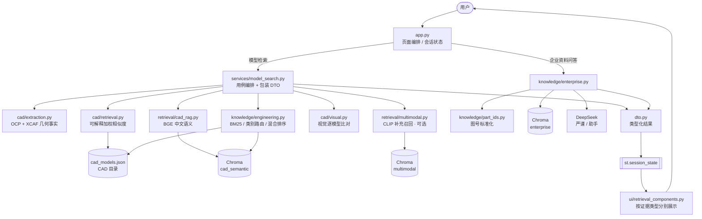
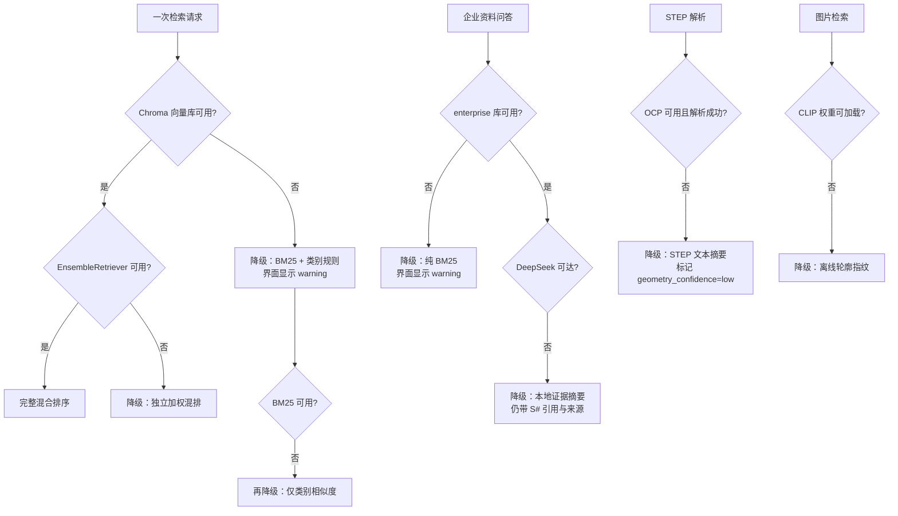
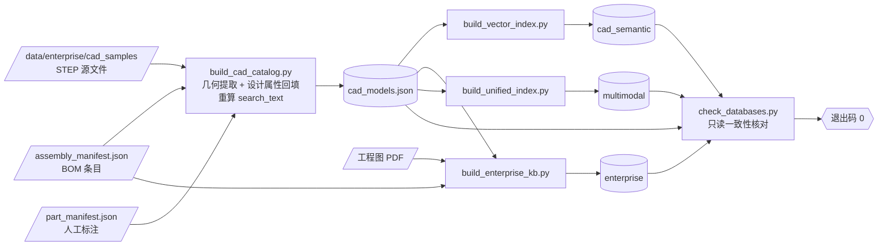

# machining_unified_ai 接手指南

> 面向新接手本项目的 Claude/Codex/开发人员。请先阅读本文件，再修改代码或数据库。

## 1. 30 秒了解项目

这是一个独立的机械智能制造融合项目：

- 前端 UI 继承自 `machining_process_rag1`；
- STEP 几何解析、模型检索、混合 RAG 和企业资料问答主要吸收自 `step_model_retrieval`；
- 两个源项目仅作为历史来源保留，日常开发只修改本项目；
- 主入口是根目录 `app.py`，业务实现全部放在 `machining_unified/` 包内；
- 页面提供两个相互独立的工作区：模型检索、企业资料问答；
- 数据库不是一个库，而是三套用途和向量空间不同的 Chroma 库。

项目目录（当前主副本，日常开发只改这里）：

```text
C:\Users\w\Desktop\machining_unified_ai
```

`C:\Users\w\PycharmProjects\machining_ai_workspace\machining_unified_ai` 是同内容的旧副本，不再维护；不要在那里改代码。

只读历史源项目：

```text
C:\Users\w\PycharmProjects\machining_ai_workspace\machining_process_rag1
C:\Users\w\PycharmProjects\machining_ai_workspace\step_model_retrieval
```

除非用户明确要求，不要修改、移动或删除这两个源项目。

## 2. 必须遵守的设计边界

1. **UI 以当前融合项目为准。** 不要重新复制源项目页面覆盖 `app.py` 或 `machining_unified/ui/`。
2. **业务代码只放在 `machining_unified/`。** 根目录除 `app.py` 外不要再次创建业务模块副本。
3. **数据路径只能从 `machining_unified/config/paths.py` 引用。** 不要在业务代码中拼接 `data/...` 硬编码路径。
4. **三套向量库保持独立。** 它们的嵌入模型、内容和分数含义不同，不能直接合并分数或集合。
5. **检索证据与模型推断必须区分。** 几何事实、语义相似度、多模态相似度、知识图谱候选和 LLM 建议不可伪装成同一种证据。
6. **企业资料回答必须可追溯。** 严谨知识库模式只使用企业资料，引用保留 `[S#]` 和来源文件。
7. **生产使用前需要人工复核。** 几何候选、图谱推断的装配关系和检索排序都不能被描述为已自动确认的生产事实。
8. **图号标准化规则只有一份。** 写入期（`scripts/import_assembly_package.py`）与查询期（`knowledge/enterprise.py`）必须共用 `knowledge/part_ids.py`，否则精确图号命中会静默失效。
9. **不要提交秘密或本地大文件。** `.env`、向量库、聊天历史和企业 STEP/BOM/图纸已由 `.gitignore` 排除。

## 3. 入口与请求流

`app.py` 只负责页面编排、会话状态和调用服务层。



结果先落 `st.session_state`、再由 UI 渲染，是刻意的闭环：检索只在**提交那一次重跑**里执行，
后续任何交互（改返回数量、切查询方式）都只重放会话状态，不会清空结果也不会重复检索。

各分支的分数含义不同（几何是代码加权分、BGE 是余弦、CLIP 是另一空间的余弦），
因此 DTO 按分支分成不同类型，UI 分区展示，**不做合并排序**。

页面组件位于：

- `machining_unified/ui/components.py`：两个工作区的主要页面组件；
- `machining_unified/ui/retrieval_components.py`：检索结果和证据展示；
- `machining_unified/ui/styles.py`：加载工业风 CSS；
- `assets/industrial.css`：主样式；
- `.streamlit/config.toml`：Streamlit 深色主题。

### 降级路径与异常处理约定

每条外部依赖失败都有明确的降级目标，且**全部会写结构化日志**（`logger.exception`），
不存在静默降级：



异常捕获的收窄原则（`except Exception` 只允许出现在下列三处，且必须写明理由）：

| 场景 | 做法 | 理由 |
|---|---|---|
| 故障模式可枚举（文件 I/O、PDF、OCCT、Chroma） | **收窄**到具体类型 | 未列出的异常属于代码缺陷，应当暴露而非降级 |
| UI 请求边界（`app.py` 三条检索分支） | 保留宽泛 + `logger.exception` | 单次查询失败不得让整页崩溃 |
| 外部服务边界（DeepSeek 调用） | 保留宽泛 + `logger.exception` | 跨 SDK/HTTP/服务端，失败模式不可枚举 |
| 清理后重抛（索引构建临时目录） | 保留宽泛 + `raise` | 必须无条件清理，且不改变原始异常 |

## 4. Python 包职责

| 目录 | 职责 | 常用入口 |
|---|---|---|
| `machining_unified/cad/` | STEP 解析、几何特征、相似度、3D 预览、视觉检索 | `extract_step_features`、`retrieve_similar_cad`、`render_step_file` |
| `machining_unified/retrieval/` | BGE/Chroma CAD RAG 与 CLIP 多模态检索 | `retrieve_cad_rag_by_text`、`retrieve_unified_by_*` |
| `machining_unified/knowledge/` | 工程语义、知识图谱、企业证据、图号规则与关联清单 | `hierarchical_retrieve`、`expand_part_relations`、`retrieve_enterprise_knowledge` |
| `machining_unified/services/` | 页面用例编排，隔离 UI 与底层实现 | `search_by_text`、`search_by_step`、`search_by_image` |
| `machining_unified/storage/` | 聊天历史与数据库注册表 | `chat_history.py`、`database_registry.py` |
| `machining_unified/config/` | 全项目路径配置 | `paths.py` |
| `machining_unified/ui/` | Streamlit 组件与样式接入 | `components.py`、`retrieval_components.py` |

新增功能时，优先放入对应包，再由 `services/` 编排，最后由 `app.py` 调用。不要让 UI 直接承担索引、文件解析或检索算法。

## 5. 数据目录

所有路径的唯一注册表：`machining_unified/config/paths.py`。

```text
data/
├─ config/                   检索打分权重（唯一可调参入口，不改源码）
├─ catalogs/                 CAD 目录、去重清单、part_id 跨模态清单
├─ knowledge/                CAD 特征模板
├─ enterprise/
│  ├─ cad_samples/           STEP/STP 原始模型
│  └─ assembly_packages/     装配包、BOM、工程图和装配清单
├─ vector_stores/            三套 Chroma 持久化库
└─ runtime/                  聊天历史等运行数据
```

重要 JSON：

- `data/catalogs/cad_models.json`：可检索 CAD 主目录，包含几何特征、设计属性和来源路径；
- `data/catalogs/cad_duplicates.json`：按 MD5 识别的重复 STEP 文件；
- `data/catalogs/part_manifest.json`：人工标注的 `part_id` 材料/类型关联，用于回填设计属性；
- `data/catalogs/unified_multimodal_manifest.json`：多模态索引构建信息；
- `data/runtime/chat_history.json`：企业资料问答历史。

## 6. 三套向量数据库

数据库注册表位于 `machining_unified/storage/database_registry.py`。

| 键 | 目录 | Chroma collection | 当前记录数 | 用途 |
|---|---|---|---:|---|
| `cad_semantic` | `data/vector_stores/cad_semantic` | `cad_models` | 24 | CAD 中文工程语义 |
| `enterprise` | `data/vector_stores/enterprise` | `enterprise_knowledge` | 66 | STEP、BOM 和工程图证据 |
| `multimodal` | `data/vector_stores/multimodal` | `unified_cad_models` | 24 | CLIP 文字/图片/STEP 表征 |

以上是 2026-08-13 的已验证基线，不应在业务代码中硬编码这些数量。数据导入后数量可以变化，应以完整性检查结果为准。

为什么不能合并：

- `cad_semantic` 使用 BGE 中文文本嵌入，面向工程语义描述；
- `enterprise` 是企业证据单元，图号精确命中会优先于泛化向量相似度；
- `multimodal` 使用 512 维 CLIP 表征，分数不能和 BGE/几何分数直接比较；
- STEP 几何相似度是代码计算的可解释加权分数，也不能伪装成向量相似度。

## 7. 本地运行

当前项目使用 Python 3.12，已存在独立 `.venv`。

```powershell
cd C:\Users\w\Desktop\machining_unified_ai
.\.venv\Scripts\python.exe -m pip install -r requirements.txt
.\.venv\Scripts\python.exe -m streamlit run app.py --server.port 8503
```

浏览器地址：`http://localhost:8503`

本地 `.env` 变量名：

```text
DEEPSEEK_API_KEY=...
DEEPSEEK_MODEL=deepseek-chat
DEEPSEEK_BASE_URL=https://api.deepseek.com
```

不要读取、打印、提交或复制真实密钥。没有 DeepSeek 密钥时，本地目录检查和全部检索分支仍可测试，只有 STEP 差异说明和企业资料问答的自然语言生成不可用（会退回本地证据摘要）。

首次使用 BGE 或 CLIP 时可能需要从 Hugging Face 下载模型；离线环境需要预先缓存模型。当前实现默认在 CPU 上运行。

## 8. 数据更新与索引重建

### 导入企业装配包

输入目录需要包含且仅包含一个装配 STEP，并带有约定目录下的 BOM/工程图：

```powershell
.\.venv\Scripts\python.exe scripts\import_assembly_package.py <资料包目录>
```

导入脚本会把审计副本放入 `data/enterprise/assembly_packages/`，把装配 STEP 放入 `data/enterprise/cad_samples/assemblies/`。

### 完整重建顺序

重建前先停止 Streamlit，并关闭可能占用 `chroma.sqlite3` 的数据库工具。

```powershell
.\.venv\Scripts\python.exe scripts\build_cad_catalog.py
.\.venv\Scripts\python.exe scripts\build_vector_index.py
.\.venv\Scripts\python.exe scripts\build_enterprise_kb.py
.\.venv\Scripts\python.exe scripts\build_unified_index.py
.\.venv\Scripts\python.exe scripts\check_databases.py
```

顺序不是习惯，是依赖关系——三套索引都从 CAD 目录派生：



关键约束：第 1 步回填设计属性后会**重算 `search_text`**，而后面三个索引的文本与向量都来自它。
因此不能只跑第 1 步——那会让目录与三套索引不一致，且 `check_databases.py` 未必能发现
（它核对数量与来源文件，不比对文本内容）。

不要只移动数据目录而不重建索引，因为 Chroma metadata 中保存了 `source_file`，旧路径会导致证据链接失效。

`scripts/migrate_data_layout.py` 是旧版扁平数据目录到当前目录结构的一次性、可重复运行迁移工具；当前目录已经迁移完成，通常不需要再次修改或运行。

## 9. 修改后的最低验收标准

### 快速静态检查

```powershell
.\.venv\Scripts\python.exe -m compileall -q app.py machining_unified scripts
.\.venv\Scripts\python.exe scripts\check_databases.py
.\.venv\Scripts\python.exe scripts\validate_part_manifest.py
```

### 自动化端到端回归

```powershell
.\.venv\Scripts\python.exe tests\test_upload_flows.py
.\.venv\Scripts\python.exe tests\test_retrieval_params.py
.\.venv\Scripts\python.exe tests\test_enterprise_answer.py
.\.venv\Scripts\python.exe tests\test_step_format_guard.py
.\.venv\Scripts\python.exe tests\test_semantic_rerank.py
```

用 Streamlit 官方 `AppTest` 在进程内跑真实 `app.py`，覆盖 STEP 上传、图片上传、
空提交防御和查询方式切换隔离，共 36 项断言；退出码 0 表示通过。
不需要浏览器，也不引入新依赖。首次运行需加载 BGE/CLIP 权重，整体约 3 分钟。

注意：`AppTest` 的每个会话有独立组件注册表，而 `cad/viewer.py` 在模块级注册三维
查看器，因此测试会在每个用例前清理 `machining_unified.*` 的模块缓存。真实部署是
单进程单注册表，不存在该问题——若看到 `Component 'step_mesh_viewer' is not registered`，
那是测试隔离没做干净，不是产品缺陷。

### 页面回归

`AppTest` 无法渲染自定义组件和 CSS，以下仍需在浏览器中人工确认：

- 工作区切换器在 1280×720 这类较矮视口下**可以点击**（历史上被透明 `stHeader` 覆盖过）；
- 结果列表很长时页面顶部**仍可滚动到达**；
- STEP 三维预览可拖动旋转、滚轮缩放；
- “企业资料问答”工作区可以显示历史对话和输入框；
- 页面启动后没有 Streamlit exception。

### 数据回归

- `scripts/check_databases.py` 返回退出码 0；
- CAD 目录 `part_id` 唯一；
- CAD 目录和清单引用的源文件存在；
- `cad_semantic`、`multimodal` 数量与 CAD 目录一致；
- 三个 collection 均存在且非空；
- 新索引 metadata 不应再出现 `data/cad_samples` 或 `data/assembly_packages` 旧路径。

## 10. 常见修改应该改哪里

| 需求 | 优先修改位置 |
|---|---|
| 调整页面布局、按钮或提示文字 | `machining_unified/ui/`，必要时修改 `app.py` |
| 调整工业风颜色和样式 | `assets/industrial.css`、`.streamlit/config.toml` |
| 修改 STEP 几何特征 | `machining_unified/cad/extraction.py`，随后重建相关索引 |
| 调整任何检索打分权重 | `data/config/retrieval_params.json`（**不要改源码**；改完刷新页面即可，`unified_embedding` 除外，它需要重建多模态索引） |
| 增删相似度比较维度 | `machining_unified/config/retrieval_params.py` 加字段，再在对应模块接线 |
| 修改 CAD 文本 RAG | `machining_unified/retrieval/cad_rag.py` |
| 修改 BM25、类别路由或知识图谱 | `machining_unified/knowledge/engineering.py` |
| 修改图片或 CLIP 检索 | `machining_unified/cad/visual.py`、`machining_unified/retrieval/multimodal.py` |
| 修改企业资料召回和回答约束 | `machining_unified/knowledge/enterprise.py` |
| 修改图号识别与标准化 | `machining_unified/knowledge/part_ids.py`（写入期与查询期共用） |
| 修改设计属性回填来源 | `machining_unified/knowledge/manifests.py`，随后重建 CAD 目录与索引 |
| 增加数据路径 | 先改 `machining_unified/config/paths.py` |
| 增加/变更向量库 | 同时改 `paths.py`、`database_registry.py` 和审计脚本 |

## 11. 容易踩坑的地方

- Windows 下 Chroma 的 SQLite 文件可能被 Streamlit、Navicat 或 DataGrip 占用，重建前先关闭相关进程。
- CAD 目录以 MD5 去重；同内容文件只保留一个可检索主记录，重复来源记录在 `cad_duplicates.json`。
- 资料组按文件所在的**直接目录**划分。装配包放在 `cad_samples/assemblies/<装配号>/`，取首层目录会把所有装配并成一个伪资料组。
- 文件名只能作为谨慎的类别提示，不能替代 STEP 几何事实。
- `design_metadata` 只允许由 BOM 或人工标注清单回填，未记载的字段必须保持 `null`；BOM 里的 `NA` 视为缺失。
- 当前 BOM（装配 630DTXT806-300-000 的下级件）与 CAD 目录（`零件1.0` 的 20 个零件）**没有交集**，因此 24 个模型里只有 3 个教学模型有材料标注，几何相似度的 11 项设计属性权重基本处于未激活状态。要提升“以模型搜模型”的质量，需要补齐资料而不是改代码。
- 自定义 CSS 会覆盖 Streamlit 的默认版式，改 `.block-container` 时必须回归两件事：透明 `stHeader` 是否吃掉了首个组件的点击，以及长页面顶部是否还能滚动到达。
- Streamlit widget 状态依赖稳定的 `key`；重命名 key 会影响跨重跑状态和历史交互。
- `st.cache_resource` 缓存向量模型和数据库连接；索引重建后，正在运行的页面可能需要重启才能加载新库。
- 多模态检索是补充召回，不替代严格尺寸、拓扑和加工特征比较。
- **裸 BGE 分数在本库上没有排序能力。** 实测 24 个模型互查，全部候选压在 0.95~0.97 的窄带内，
  top-3 分数极差均值仅 0.005，自检索命中率 37.5%，且存在单一模型垄断半数查询榜首的 hub 效应。
  因此 STEP 分支把语义召回降级为候选集（k×3），由 `score_cad_similarity` 的几何加权分决定名次。
  界面必须同时显示两个分数——名次来自几何分，语义分只表示召回强度。
- **不要为了提升模型检索而删掉索引里的族级功能叙述。** 实测删除后模型自检索确有提升
  （37.5% → 62.5%），但功能性文字查询的纯语义命中从 3/3 掉到 0/3，且 STEP 异族混入反而
  从 4% 升到 10%。噪声问题由几何重排解决，不由删文本解决。
- `langchain-community` 当前会出现维护状态警告，但现有 `PyPDFLoader` 链路仍可运行；迁移依赖时要做完整文档加载回归。
- Streamlit 的文件监视器会遍历 `transformers` 的惰性模块树，日志里会反复出现 `No module named 'torchvision'` 的 traceback。这是探测噪音，不影响功能；项目本身不需要 torchvision。

## 12. 当前已验证状态

最近一次改动完成于 2026-08-13，项目已裁剪为纯检索系统：

- 工艺推荐工作区及其全部依赖已移除，向量库由四套变为三套；
- 图号识别不再只认 DTXT，`CGT1`/`KBT`/`RGK`/`SWDL` 等编码体系可获得精确命中；
- 知识图谱扩展已接入几何检索结果，不再是死代码；
- 设计属性可由 BOM 与人工标注清单回填（当前数据下只覆盖 3 个教学模型）；
- 修复工作区切换器被透明顶栏遮挡、以及长页面顶部无法滚动到达两个 CSS 缺陷；
- 检索结果已存入会话状态，非提交重跑不再清空结果；
- CAD 目录与三套索引已全部重建，完整性检查通过（24 / 66 / 24）；
- Python 编译通过；两个 Streamlit 工作区在 1280×720 下渲染、切换与真实文字检索均通过。

开始新任务前，先运行：

```powershell
.\.venv\Scripts\python.exe scripts\check_databases.py
```

完成任务后，在说明中列出修改文件、是否重建数据库、数据库检查结果以及尚未验证的外部依赖。
